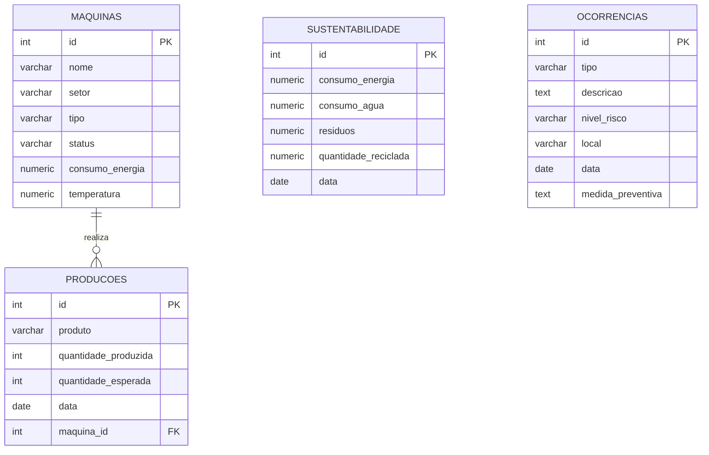

# Diagrama Entidade-Relacionamento

```mermaid
erDiagram
  MAQUINAS ||--o{ PRODUCOES : realiza
  MAQUINAS {
    int id PK
    varchar nome
    varchar setor
    varchar tipo
    varchar status
    numeric consumo_energia
    numeric temperatura
  }
  PRODUCOES {
    int id PK
    varchar produto
    int quantidade_produzida
    int quantidade_esperada
    date data
    int maquina_id FK
  }
  SUSTENTABILIDADE {
    int id PK
    numeric consumo_energia
    numeric consumo_agua
    numeric residuos
    numeric quantidade_reciclada
    date data
  }
  OCORRENCIAS {
    int id PK
    varchar tipo
    text descricao
    varchar nivel_risco
    varchar local
    date data
    text medida_preventiva
  }
```

Uma máquina pode ter várias produções; cada produção pertence a uma única máquina. Os registros ambientais e de segurança permanecem independentes nesta etapa.

